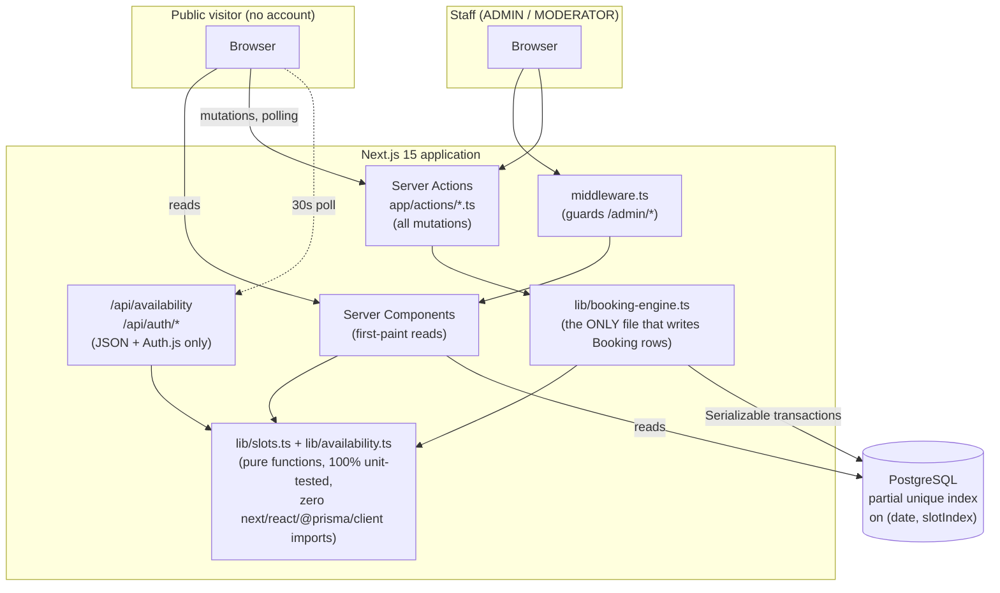
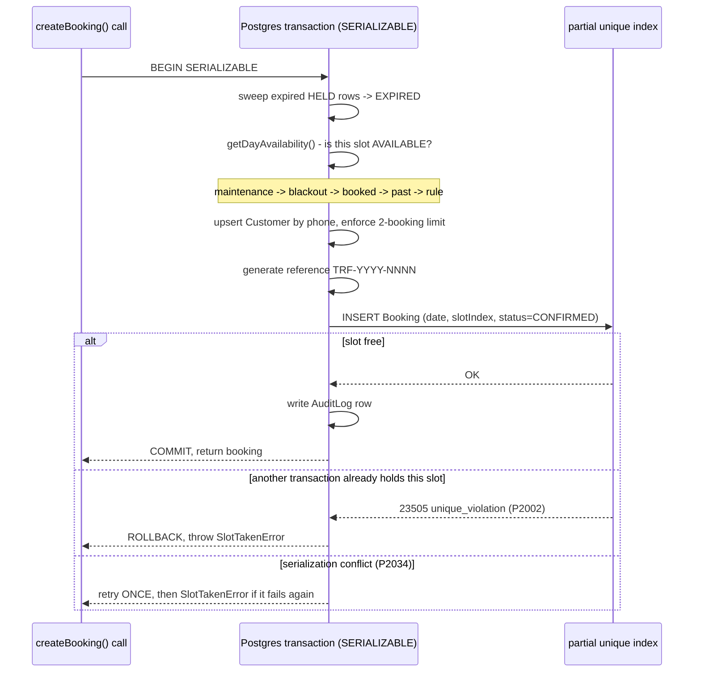
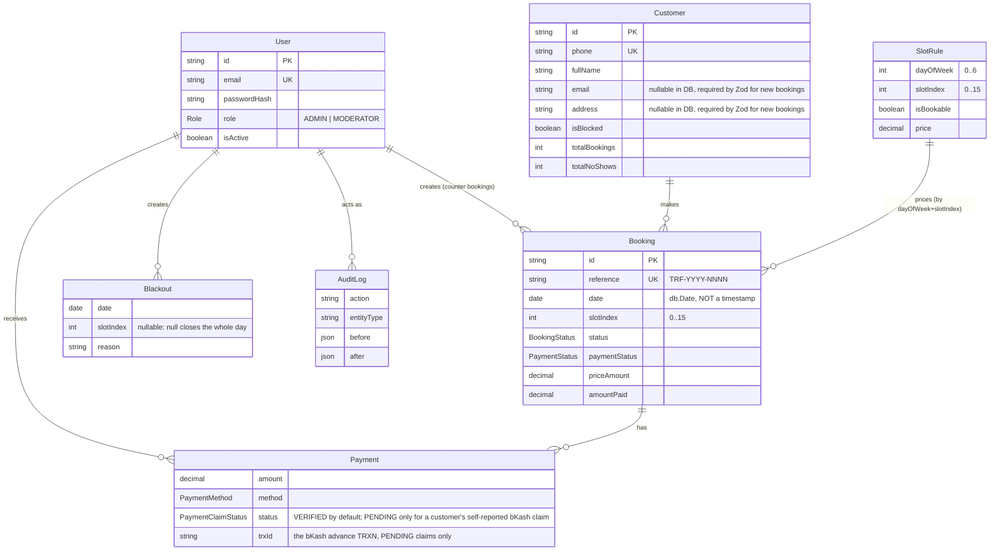
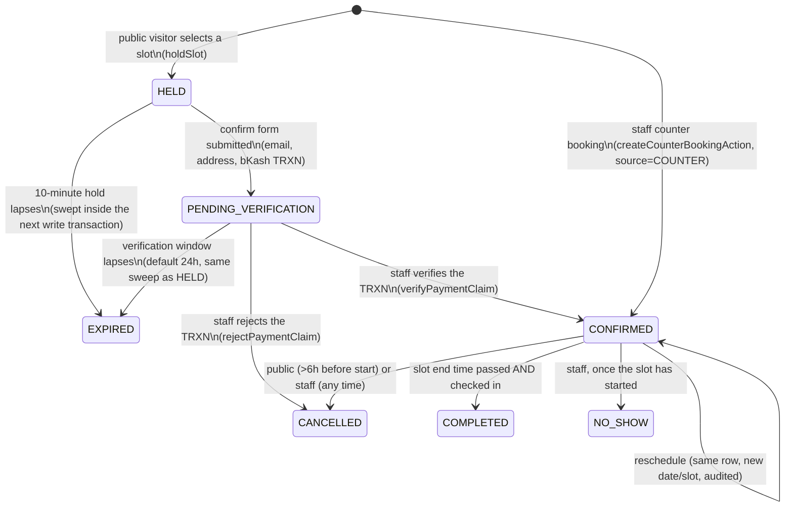

# Turfly: Booking & Management System

A full-stack web application for booking a single football turf online, with a staff admin
panel for running the venue day to day. Built as a university project: one developer, twelve
weeks, one field, open 24 hours.

This README explains **what the system does, how it is built, and why it is built that way** —
it is written to double as viva/presentation material, not just a setup guide. The original
specification this was built from is kept in the repo as living documentation:
[`CLAUDE.md`](./CLAUDE.md) (domain rules, the design system, the data model) and
[`BUILD_PLAN.md`](./BUILD_PLAN.md) (the exact step order this was implemented in, with a demo
script at the bottom).

---

## Table of contents

1. [What problem this solves](#1-what-problem-this-solves)
2. [Tech stack, and why](#2-tech-stack-and-why)
3. [System architecture](#3-system-architecture)
4. [The correctness core: how double-booking is prevented](#4-the-correctness-core-how-double-booking-is-prevented)
5. [Domain model](#5-domain-model)
6. [Booking lifecycle (state machine)](#6-booking-lifecycle-state-machine)
7. [Route map](#7-route-map)
8. [Authentication and authorization](#8-authentication-and-authorization)
9. [Project structure](#9-project-structure)
10. [Testing strategy](#10-testing-strategy)
11. [Getting started](#11-getting-started)
12. [Environment variables](#12-environment-variables)
13. [Design system](#13-design-system)
14. [CI/CD](#14-cicd)
15. [Known limitations and future work](#15-known-limitations-and-future-work)
16. [Demo script](#16-demo-script)

---

## 1. What problem this solves

A small five-a-side/turf venue with one physical field needs two things that are normally sold
as two separate products: a **public booking page** so customers can reserve a slot without
phoning the venue, and a **back-office tool** so the owner and counter staff can see, amend, and
account for every booking without touching a spreadsheet.

The interesting engineering problem underneath both is not the UI — it is **making it structurally
impossible for two people to book the same 90-minute slot at the same time**, even under real
concurrent load, without resorting to pessimistic locking that would make the booking page feel
slow. Section 4 below is the part of this project worth spending the most viva time on.

## 2. Tech stack, and why

| Layer | Choice | Why |
|---|---|---|
| Framework | Next.js 15, App Router, TypeScript strict | Server Components give first-paint data without a client fetch waterfall; Server Actions give type-safe mutations without hand-rolling REST endpoints. |
| UI | React 19, Tailwind CSS v4, shadcn/ui (Radix primitives) | Radix gives accessible, unstyled interactive primitives (dialogs, dropdowns, selects); Tailwind's CSS-first `@theme` maps cleanly onto a fixed 9-colour design token system (§13). |
| Database | PostgreSQL 16 + Prisma 6 | Postgres because the correctness guarantee (§4) needs a **partial unique index**, a feature Prisma's schema DSL cannot express — the migration is hand-written SQL. Prisma for everything else: typed queries, migrations, transactions. |
| Auth | Auth.js v5, credentials provider, JWT session | No third-party identity provider needed for two internal staff roles; JWT avoids a session table for something this small. |
| Validation | Zod | One schema object is imported by both the client form (`zodResolver`) and the Server Action (`schema.parse()`) — validation cannot drift between the two, because there is only one copy of it. |
| Forms | React Hook Form | Uncontrolled-by-default form state, pairs directly with Zod via `@hookform/resolvers`. |
| Dates | date-fns / date-fns-tz | Slot arithmetic is deliberately native `Date` (see §4's timezone note); date-fns-tz is used specifically for *display* formatting, so rendering stays correct in `Asia/Dhaka` independent of the arithmetic layer. |
| Email | Resend + React Email | A `Notifier` interface abstracts the transport (`lib/notifications/`) so Resend can be swapped for anything else without touching call sites. |
| Charts | Recharts | Revenue-by-period bar chart on `/admin/reports`. The slot-utilisation heat map is a plain HTML table with computed background colour, not a charting library — a heat map's real content is the *number in each cell*, which a chart library would make harder to keep as accessible text. |
| Testing | Vitest, Testing Library, Playwright, axe-core | See §10. |
| Hosting (target) | Vercel + Neon | Serverless Postgres pairs naturally with Vercel's serverless Next.js functions. Not deployed by the current repository state — see [`DEPLOYMENT.md`](./DEPLOYMENT.md). |

## 3. System architecture



Three rules hold everywhere in the codebase (from `CLAUDE.md` §4):

- **Mutations are Server Actions**, never hand-written POST route handlers (the two exceptions —
  `/api/auth/*` and the CSV export at `/admin/reports/export` — are route handlers *by necessity*:
  Auth.js owns its own handler, and a file download cannot be a Server Action, which returns
  data, not a `Response`).
- **Reads for first paint are Server Components.** `/book/[date]` renders its initial slot grid
  server-side; the client only polls afterwards, to catch a slot someone else just took.
- **Availability is computed by exactly one function**, `getDayAvailability()` in
  `lib/availability.ts`, used identically by the public page, the JSON API, the admin dashboard,
  the admin calendar, and the booking engine's own internal checks. There is no second
  implementation anywhere to drift out of sync with the first.

## 4. The correctness core: how double-booking is prevented

This is the part of the system that matters most and the part most worth demonstrating live
(see §16).

**The guarantee is enforced by the database, not by application logic.** A partial unique index:

```sql
CREATE UNIQUE INDEX one_live_booking_per_slot
ON "Booking" (date, "slotIndex")
WHERE status IN ('HELD', 'CONFIRMED', 'COMPLETED', 'PENDING_VERIFICATION');
```

Prisma's schema language cannot express a partial index (a `WHERE` clause on a unique
constraint), so this line is **hand-written SQL** inside the generated migration
(`prisma/migrations/.../migration.sql`) — Prisma's schema still declares a plain `@@unique` as a
placeholder so the generated TypeScript types have the right shape, but the actual constraint
that runs inside Postgres is this partial index. It is *partial* specifically so that a
**cancelled** booking (status `CANCELLED`/`EXPIRED`/`NO_SHOW`) frees the slot back up — a plain,
non-partial unique constraint would permanently block that slot forever after the first
cancellation, which is wrong.

`PENDING_VERIFICATION` was added later, for the bKash advance-payment flow (§6): a customer's
submitted booking stays exclusively reserved while staff verify the transaction, not just while
`HELD`/`CONFIRMED`/`COMPLETED`. Adding a value to a Postgres enum and using that value in an index
predicate can't happen in the same transaction, so this was two migrations, applied in order —
see the note at the bottom of `prisma/schema.prisma`.

Every write to `Booking` funnels through `lib/booking-engine.ts`, and every one of those writes
happens inside a **Serializable** transaction, in this fixed order:



This is proven, not just claimed: [`e2e/concurrency.spec.ts`](./e2e/concurrency.spec.ts) fires
**20 simultaneous `createBooking()` calls at the exact same slot** against a real, unmocked local
Postgres, and asserts exactly one `fulfilled` promise and nineteen rejections, each a
`SlotTakenError`, then re-queries the database directly to confirm there is really only one live
row. `pnpm e2e` runs it; the terminal output is the single most convincing thirty seconds of the
whole project.

The diagram above is the **counter-booking path** (staff, `INSERT ... status=CONFIRMED` directly)
— it's the one the concurrency test exercises, since it's the path that actually races on the
INSERT. The **public online path** goes through one extra step first: `createBooking()` with a
`holdId` moves that row from `HELD` to `PENDING_VERIFICATION` instead of `CONFIRMED` — same
partial index, same exclusive reservation, but a human has to verify the bKash advance before it
becomes `CONFIRMED` (§6, §4b below).

### 4b. The bKash advance-verification flow

`CLAUDE.md` invariant 10, added alongside the domain spec: **a public booking is never
`CONFIRMED` on submission.** The confirm form (`/book/confirm`) collects email, address and a
bKash "Send Money" transaction ID for a small advance (amount set in `/admin/pricing`, `৳1000` by
default) and submits it — that moves the row to `PENDING_VERIFICATION`, not `CONFIRMED`. A staff
member checks the TRXN against their own bKash statement (there is no merchant API integration —
verification is manual by design, see §15) from `/admin/bookings/[id]`, and either:

- **Verifies it** (`verifyPaymentClaim`) → the claim's `Payment` row flips to `VERIFIED`, its
  amount is folded into `amountPaid`/`paymentStatus` exactly like a normal recorded payment, and
  the booking becomes `CONFIRMED`. This is the only place `notifyBookingConfirmed` fires for an
  online booking — sending a "confirmed" email before anyone checked the money would be a lie.
- **Rejects it** (`rejectPaymentClaim`) → `Payment.status` flips to `REJECTED` with a reason, and
  the booking is `CANCELLED`, releasing the slot immediately.

If staff do neither, the claim isn't left locking the slot forever: `VenueSetting.paymentVerificationHours`
(default 24h) is a second, independent deadline on the row, alongside `holdExpiresAt`'s 10 minutes
for the earlier `HELD` state — the same sweep that expires stale holds also expires stale
unverified claims, inside every write transaction (`sweepExpiredHolds` in `lib/booking-engine.ts`,
despite the name predating this feature).

**A second, quieter correctness detail:** Prisma serializes a `@db.Date` column using a JS
`Date`'s **UTC** year/month/day, not its local ones. Every place in this codebase that builds a
`date` value bound for that column goes through one function,
`lib/availability-service.ts`'s `dateOnly()`, which converts a local calendar day into a
UTC-midnight `Date` carrying the *same digits*. Skipping that conversion was a real bug found
during manual testing of this project (see the git log around the step 4 commit) — in
`Asia/Dhaka` (UTC+6), a naive local-midnight `Date` silently stores on the *previous* calendar
day.

## 5. Domain model

Seven entities. `User` is staff only; `Customer` is the public visitor, keyed by phone number,
and **never authenticates** — there is no Customer login anywhere in the system.



Key modelling decisions:

- **A slot is an integer 0–15, never a timestamp pair.** `1440 minutes / 90 = 16` exactly, so the
  whole day is representable without any rounding. `lib/slots.ts` converts an index to a
  `(startsAt, endsAt)` pair on demand; nothing is ever stored as a time range.
- **Slot index 4 (06:00–07:30) is permanently unbookable, every day.** This lives in two places
  deliberately: seeded as `isBookable: false` on every `SlotRule` row for slot 4 (data), *and*
  hard-coded as `isMaintenanceSlot()` in `lib/slots.ts` (code) — belt and braces, so a bad seed or
  a bad admin action can never accidentally make the maintenance window bookable.
- **`Booking.date` is a calendar day (`@db.Date`), never compared directly with `new Date()`.**
  See §4's timezone note.
- **`AuditLog` has no foreign key to the entity it describes** (`entityType` + `entityId` as
  plain strings instead). Deliberate: an audit row must survive the deletion of the thing it
  describes. Nothing in this app hard-deletes a `Booking`, but the audit trail is designed to
  outlive that assumption changing later.

## 6. Booking lifecycle (state machine)



Every transition not drawn above is rejected in the domain layer
(`lib/booking-engine.ts`) with a typed error — there is no code path that can, for example, mark
a `HELD` booking as `NO_SHOW`, confirm a booking straight from `HELD` without going through
verification, or cancel something already `CANCELLED`.

## 7. Route map

| Route | Access | Purpose |
|---|---|---|
| `/` | Public | Landing page. |
| `/book` | Public | Redirects to `/book/{today}`. |
| `/book/[date]` | Public | The booking page: date strip (14-day window) + 16-slot grid, polls for freshness every 30s. |
| `/book/confirm` | Public | Finish the booking form for a slot already held (10-minute countdown shown). |
| `/book/success/[ref]` | Public | Receipt after a successful confirmation. |
| `/booking/lookup` | Public | Find a booking by reference + phone; cancel it if more than 6 hours out. |
| `/rules` | Public | Venue policy, pulled partly from the database (`VenueSetting`). |
| `/login` | Public | Staff sign-in. |
| `/admin` | Staff | Dashboard: the day's 16 slots, current one highlighted, one-tap check-in. |
| `/admin/calendar` | Staff | Month view, free-slot counts, links into the dashboard per day. |
| `/admin/bookings` | Staff | Searchable/filterable table of every booking. |
| `/admin/bookings/[id]` | Staff | One booking: amend, cancel, reschedule, record payment, internal note. |
| `/admin/bookings/new` | Staff | Counter booking for a walk-in/phone customer. |
| `/admin/blackouts` | Staff | Close a slot or a whole day ahead of time; warns about affected bookings first. |
| `/admin/customers` | Staff | Every customer, lifetime totals, no-show count, block/unblock. |
| `/admin/pricing` | **ADMIN only** | Bulk price editing (weekday/weekend × standard/peak). |
| `/admin/reports` | **ADMIN only** | Revenue, utilisation heat map, CSV export. |
| `/admin/users` | **ADMIN only** | Create/disable staff accounts, change roles. |
| `/admin/audit` | **ADMIN only** | Read-only log of every mutation ever made, with a before/after diff. |
| `GET /api/availability?date=` | Public (JSON) | The exact same availability data the pages render, polled by the slot grid. |
| `GET /admin/reports/export` | **ADMIN only** | CSV download for a date range. |

"Staff" means either role, `ADMIN` or `MODERATOR`. `middleware.ts` enforces the split between
"any staff" and "ADMIN only" at the edge, but **that alone is not treated as authorization** —
every Server Action that mutates something re-checks the caller's role itself via
`lib/auth/require-role.ts`, so a bug in the middleware's route matching could never accidentally
grant a MODERATOR access to an ADMIN-only mutation.

## 8. Authentication and authorization

- **Customers never authenticate.** The public flow only ever asks for a phone number (used as
  the natural key for the `Customer` table) and a name.
- **Staff sign in with Auth.js v5's credentials provider**: email + password, bcrypt (cost 12),
  an HTTP-only `SameSite=Lax` JWT session cookie (Secure automatically over HTTPS), 8-hour
  expiry. Login is rate-limited to 10 attempts per 15 minutes per IP
  (`lib/auth/rate-limit.ts`).
- **Two roles**, `ADMIN` and `MODERATOR`. `middleware.ts` redirects an unauthenticated visitor to
  `/login` for anything under `/admin/*`, and redirects a non-ADMIN away from the four
  ADMIN-only routes. `lib/auth/require-role.ts`'s `requireRole()` is called again inside every
  single staff Server Action — this double-check is deliberate and tested
  (`e2e/rbac.spec.ts` drives a real browser session for both roles against every route).

## 9. Project structure

```
lib/
  slots.ts                 Pure slot arithmetic — imports nothing from next/react/@prisma/client.
  availability.ts           Pure — the ONE function that decides a slot's state (100% test coverage).
  availability-service.ts   Bridges Prisma <-> the pure function; owns the UTC-date conversion.
  booking-engine.ts         The only file allowed to write a Booking row. Transactions, errors, audit.
  completion.ts             Opportunistic CONFIRMED -> COMPLETED sweep (no cron at this scale).
  reports.ts                Revenue/utilisation aggregation, shared by the page and the CSV export.
  notifications/            Notifier interface: ResendNotifier, ConsoleNotifier, NoopNotifier.
  notify.ts                 Retry-with-backoff wrapper Server Actions call after a mutation commits.
  schemas/                  Zod schemas, each imported by both a client form and a Server Action.
  auth/                     require-role.ts (defence in depth), rate-limit.ts.
app/
  actions/                  Server Actions, one file per domain area (bookings, admin-bookings,
                             blackouts, customers, pricing, users).
  (public routes)           /  /book  /book/[date]  /book/confirm  /book/success/[ref]
                             /booking/lookup  /rules  /login
  admin/                    The staff panel — see the route map above.
  api/                      /api/availability (JSON), /api/auth/* (Auth.js).
components/
  booking/                  Public-flow client components (SlotGrid, SlotCard, HoldTimer, ...).
  admin/                    Admin-panel client components (ConfirmDialog, forms, charts, ...).
  ui/                       shadcn/ui primitives, restyled to the design tokens in CLAUDE.md §6.
  site/                     Shared header/footer.
e2e/                        concurrency.spec.ts, rbac.spec.ts, accessibility(.-admin).spec.ts.
prisma/
  schema.prisma             The data model (see §5). The partial index is NOT expressible here —
                             see the note at the bottom of the file.
  migrations/                Includes the hand-edited migration with the real partial index SQL.
  seed.ts                   112 SlotRule rows, one ADMIN + one MODERATOR user, VenueSetting.
```

## 10. Testing strategy

| Layer | Tool | What it proves | Command |
|---|---|---|---|
| Pure logic | Vitest | `lib/slots.ts` and `lib/availability.ts` at **100% statement/branch/function/line coverage** — the slot-15 label trap, the maintenance-slot invariant, the past-vs-booked check order, all 5 slot states. | `pnpm test:coverage` |
| Concurrency | Playwright, real Postgres | 20 simultaneous bookings at one slot, exactly 1 wins, verified both via the promises and a direct re-query of the database. | `pnpm e2e` (`e2e/concurrency.spec.ts`) |
| Authorization | Playwright, real browser sessions | Unauthenticated, MODERATOR, and ADMIN sessions each checked against every `/admin/*` route. | `pnpm e2e` (`e2e/rbac.spec.ts`) |
| Accessibility | Playwright + axe-core | Every public route and the full admin panel, tagged `wcag2a`/`wcag2aa`, fails the build on any `critical`/`serious` violation. Three real violations were found and fixed this way (see the git log), not synthetic examples. | `pnpm e2e` (`e2e/accessibility*.spec.ts`) |
| Types | `tsc --noEmit`, strict mode | No `any` escapes, exhaustive discriminated unions on booking status. | `pnpm typecheck` |

`pnpm e2e`'s login-based tests are deliberately economical with how many times they sign in —
the rate limiter (10 attempts/15 min) shares one bucket across an entire local run because
localhost traffic has no `x-forwarded-for` header to distinguish clients by. This bit the test
suite once during development; the fix (log in once per file, loop routes inside one test rather
than one test per route) is preserved in `e2e/accessibility-admin.spec.ts` as the pattern to
follow for any future test file that needs an authenticated session.

That bucket is now a `RateLimitBucket` database row, not an in-memory `Map` (see §15's production
hardening) — it **persists across `next dev` restarts**, where the old in-memory version reset on
every one. Running `pnpm e2e` (or logging in manually) more than ~10 times in a 15-minute local
session will genuinely rate-limit yourself, and every subsequent login-based test will fail with a
`waitForURL` timeout that has nothing to do with your code change. If that happens:
```bash
psql "$DATABASE_URL" -c "DELETE FROM \"RateLimitBucket\" WHERE key LIKE 'login%';"
```

## 11. Getting started

Requires Node 20.19+/22.12+/24+, `pnpm`, and a local PostgreSQL 16 (`docker-compose.yml` is
included; a native Postgres install works just as well — that's what this repository was
actually developed against).

```bash
cp .env.example .env        # fill in DATABASE_URL and your Clerk keys
docker compose up -d        # or point DATABASE_URL at your own Postgres
pnpm install
pnpm prisma migrate deploy  # applies the partial-index migration as-is — do not regenerate it
pnpm db:seed                # 112 SlotRule rows, one ADMIN + one MODERATOR user, VenueSetting
pnpm dev
```

Seeded staff logins (override with `SEED_ADMIN_PASSWORD` / `SEED_MODERATOR_PASSWORD` before
seeding anything that isn't a throwaway local database):

| Email | Password | Role |
|---|---|---|
| `admin@turf.local` | `Admin123!` | ADMIN |
| `moderator@turf.local` | `Moderator123!` | MODERATOR |

Other scripts:

```bash
pnpm build / start    # production build / serve
pnpm typecheck         # tsc --noEmit, strict
pnpm lint              # eslint
pnpm format            # prettier --write
pnpm prisma:studio     # inspect the database visually
```

## 12. Environment variables

All of them, no secrets in code:

```
DATABASE_URL                 Postgres connection string
NEXT_PUBLIC_CLERK_PUBLISHABLE_KEY   Clerk publishable key (pk_test_… / pk_live_…)
CLERK_SECRET_KEY             Clerk secret key (sk_test_… / sk_live_…)
RESEND_API_KEY                Only read in production; dev uses ConsoleNotifier regardless
SMS_API_KEY                   Reserved — no SMS provider is wired up (email-only Notifier today)
NOTIFICATIONS_ENABLED         'false' -> NoopNotifier (safe default for local dev)
HOLD_MINUTES                  10
CANCELLATION_WINDOW_HOURS     6
BOOKING_WINDOW_DAYS           14
TZ                            Asia/Dhaka — the whole app assumes this; see §4's timezone note
```

## 13. Design system

Nine colours, one accent, no dark mode, Inter only. `CLAUDE.md` §6 is authoritative; nothing in
the UI uses a colour, font size, or spacing value outside it. shadcn/ui components are added via
`pnpm dlx shadcn@latest add <component>` and then restyled to these tokens (see
`app/globals.css`'s `@theme` block, which remaps shadcn's own semantic variable names — `--primary`,
`--border`, etc. — onto this fixed palette, so every future `shadcn add` already matches without
per-component overrides).

```
surface        #FFFFFF   page background
surface-muted  #F9FAFB   cards, table headers, disabled slots
border         #E5E7EB   all hairlines and input outlines
text           #111827   headings, primary text
text-muted     #6B7280   labels, captions, helper text
accent         #15803D   primary buttons, available slots, confirmations
accent-soft    #DCFCE7   available-slot fill, success banners
warning        #B45309   maintenance, blackouts, expiring holds
danger         #B91C1C   destructive actions, validation errors
```

State is never colour-only: a booked slot also reads "Booked", a maintenance slot also reads
"Maintenance". This is not just a style guideline — it is enforced by the axe-core pass in CI.

## 14. CI/CD

`.github/workflows/ci.yml` runs on every push and pull request against `main`:

```
typecheck -> lint -> unit tests (100% coverage gate on lib/) -> build
  -> Playwright against a real Postgres service container
     (concurrency proof + RBAC + accessibility)
  -> Lighthouse + a second axe pass against the production build,
     with score thresholds (lighthouserc.json)
```

None of this touches a real deployment target — CI provisions its own throwaway Postgres
container per run. See [`DEPLOYMENT.md`](./DEPLOYMENT.md) for the actual Vercel + Neon steps,
which need real account credentials this repository's automation does not have.

## 15. Known limitations and future work

- **SMS notifications are not implemented.** `SMS_API_KEY` is reserved in the env var list per
  the original spec, but only the email channel (`ResendNotifier`) exists today.
- ~~The login rate limiter is in-memory, per-process~~ — fixed: it's backed by a `RateLimitBucket`
  table now (`lib/auth/rate-limit.ts`), specifically so it holds up across Vercel's serverless
  instances rather than resetting on every cold start.
- **Utilisation in `/admin/reports` is an estimate**: it divides booked slots by
  `days × 15 bookable slots`, without subtracting blackouts from that denominator. Good enough
  for the qualitative "which slots are dead" read the report is for, not a billing figure.
- **No automated Lighthouse budget enforcement locally** — only in CI, against the deployed
  build.
- **bKash verification is manual, by design.** This app has no bKash merchant/payment-gateway API
  integration (that requires a registered merchant account this project doesn't have) — a
  customer's submitted TRXN ID is just a string until a staff member checks it against their own
  bKash statement and clicks Verify. A real production deployment handling meaningful volume would
  want the merchant API instead, so verification isn't a manual queue.
- **A fabricated TRXN can lock a slot for up to `paymentVerificationHours` (default 24h).**
  `holdSlotAction` is rate-limited per IP (§4b), and the 2-active-booking cap counts
  `PENDING_VERIFICATION` too, but neither stops a determined attacker rotating IPs and phone
  numbers from squatting several slots with plausible-looking-but-fake TRXN strings until staff
  reject them. Lowering `paymentVerificationHours` in `/admin/pricing` shrinks the exposure window
  at the cost of a shorter grace period for slow-to-check staff. Phone-number verification (OTP at
  hold time) would close this properly; it's out of scope here — see the demo script's own honesty
  about what this project is and isn't (§16).

## 16. Demo script

The order this project's `BUILD_PLAN.md` recommends presenting it in (roughly twelve minutes):

1. **Book a slot on a phone**, projected — under 90 seconds, no login. Submit a (fake, for the
   demo) bKash TRXN and show the receipt page reads "awaiting payment verification", not
   "confirmed" — then switch to `/admin/bookings/[id]` and verify it live, explaining why the
   slot stayed locked the whole time (the widened partial index).
2. **Run the concurrency test live**: `pnpm e2e -g concurrency`. Twenty requests, one wins.
   Explain the partial unique index. *(Lead with this if short on time — it is the single most
   convincing thing in the project.)*
3. **Log in as MODERATOR, try `/admin/pricing`.** Get refused.
4. **Log in as ADMIN, create a blackout** on tomorrow's evening slot. Refresh the public page —
   it is gone immediately.
5. **Show the utilisation heat map** on `/admin/reports`. Point at a dead slot and say what
   you'd price it at.
6. **Show `lib/slots.ts` and its test file**, and the coverage report. Explain why it imports
   nothing.

The point to land: **correctness is enforced by the database, not by hope.**

## Subdomain routing

Every venue is served at `{slug}.turfly.app`. The booking pages keep ordinary
paths — only the host distinguishes one venue from another
(`lib/request-venue.ts`).

**Locally**, use `*.lvh.me`, which resolves to `127.0.0.1` publicly — no
`/etc/hosts` editing and no wildcard DNS:

```
http://test-venue.lvh.me:3000/book
http://localhost:3000/book          # the bare domain still serves Venue Zero
```

**In production** this needs two things done by hand, outside the codebase:

1. A wildcard DNS record — `*.turfly.app` — pointing at Vercel.
2. `*.turfly.app` added as a domain in the Vercel project.

Set `NEXT_PUBLIC_ROOT_DOMAIN` to the deployment's own domain. Until the
wildcard exists, venues are still fully usable at the bare domain; they just
do not have their own address yet.
